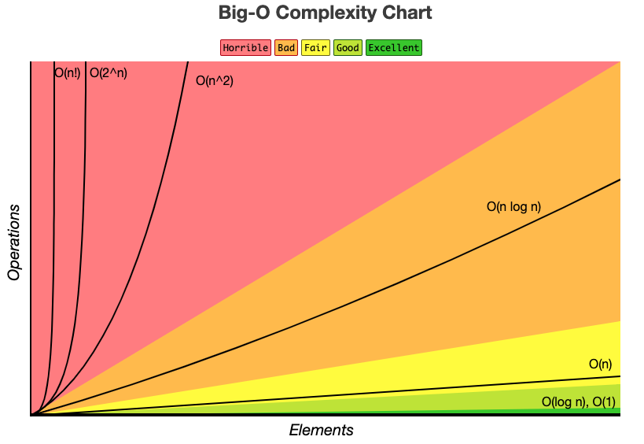

# JavaScript Algorithms

## Big O Notation Graph
Source below is from [bigocheatsheet.com](https://www.bigocheatsheet.com/):


## Ways to Practice
- [JavaScript Data Structures & Algorithms + LEETCODE Exercises](https://www.udemy.com/course/data-structures-algorithms-javascript/) by Scott Barrett, Udemy
- [Software Engineering Interviews](https://www.tryexponent.com/courses/software-engineering) ([TryExponent.com](https://www.tryexponent.com/) paid course)
- [Use Quokka.js Pro](https://quokkajs.com/) in Visual Studio Code
- Courses:
  - [Software Engineering Interviews](https://www.tryexponent.com/courses/software-engineering) (paid course via Exponent)
  - Eric Traub Udemy courses:
    - [Learning Data Structures in JavaScript from Scratch](https://www.udemy.com/course/learning-data-structures-in-javascript-from-scratch/?couponCode=ST14MT101024)
    - [Learning Algorithms in JavaScript from Scratch](https://www.udemy.com/course/learning-algorithms-in-javascript-from-scratch/)

## Understanding Big O Notation

- Among the three types of asymptotic notation (Big O, Omega, and Theta) **Big O notation** is the most commonly used because it provides an upper bound on an algorithm’s running time, representing the worst-case scenario.
- Comparing Big O complexity Table
  | Complexity                          | Big-O notation                    | Performance                |
  | ----------------------------------- | --------------------------------- | -------------------------- |
  | :green_heart: Constant              | :green_heart: O(1)                | :green_heart: Excellent    |
  | :white_check_mark: Logarithmic      | :white_check_mark: O(log n)       | :white_check_mark: Good    |
  | :warning: Linear                    | :warning: O(n)                    | :warning: Acceptable       |
  | :large_orange_diamond: Linearithmic | :large_orange_diamond: O(n log n) | :large_orange_diamond: Bad |
  | :exclamation: Quadratic             | :exclamation: O(n^2)              | :exclamation: Terrible     |
  | :exclamation: Exponential           | :exclamation: O(2^n)              | :exclamation: Terrible     |
  | :exclamation: Factorial             | :exclamation: O(n!)               | :exclamation: Terrible     |

## Big O `O(n)`: Linear Time Complexity

The code below has a Big O time complexity of `O(n)`, or a __Linear__ time complexity. The time complexity of `O(n)` is __Good__, and not __Excellent__ like `O(1)` which is __Constant__ time complexity.

Often referred to as __Proportional__.

```js
function logitems(n) {
    for(let i = 0; i < n; i++) {
        console.log(i);
    }
}
```

## Drop Constants
The code below has a Big O time complexity of `O(2n)`. However, in Big O notation it's common to drop constants so it's commonly said the code below has a Big O time complexity of `O(n)` and __NOT__ `O(2n)`.

```js
function logitems(n) {
    for(let i = 0; i < n; i++) {
        console.log(i);
    }

    for(let j = 0; j < n; j++) {
        console.log(j);
    }    
}
```
## Big O `O(n^2)`: Quadratic Time Complexity
The code below has a Big O time complexity of `O(n^2)`, which is considered __Terrible__. Often nested loops have a Quadratic time complexity and should be avoided whenever possible, compared to a Constant time complexity (`O(1)`) or Linear time complexity (`O(n)`).

Often referred to as __Loop within a Loop__.

```js
function logitems(n) {
    for(let i = 0; i < n; i++) {
        for(let j = 0; j < n; j++) {
            console.log(i, j);
        }   
    } 
}
```

## Drop Non-Dominants
The code below has a Big O time complexity of `O(n^2 + n)`. However, since `n^2` is the dominant term (or shows the largest increase in time complexity) and `n` is the non-dominant term (or shows the smallest increase in time complexity), the Big O time complexity of the code below is expressed as `O(n^2)` as the non-dominant term is dropped.

```js
function logitems(n) {
    for(let i = 0; i < n; i++) {
        for(let j = 0; j < n; j++) {
            console.log(i, j);
        }   
    } 

    for(let k = 0; k < n; k++) {
        console.log(k);
    }       
}
```

## Big O `O(1)`: Constant Time Complexity
Example code below, which only has 1 operation and is referred to as __Constant__ time.

Often referred to as __Constant__.

```js
function addItems(n) {
 return n + n;
}
```

Usually in JavaScript (or other programming languages) if a function has a `console.log` or `return` and includes __NO__ loops then the time complexity if `O(1)` or __Constant__.

__Constant__ time is the most efficient Big O notation for time.

## Big O `O(log n)`: O of log n Time Complexity
__O of log n__ (`O(log n)`) has __Good__ time complexity, and is the most time efficient Big O notation __EXCEPT__ for __Constant__ time complexity (`O(1)`). 

Often referred to as __Divide and Conquer__.

The __Binary Search__ algorithm below has __O of log n__ (`O(log n)`) time complexity, assuming that a sorted array is passed in as an argument:

```js
function binarySearch(arr, target) {
  // Define the recursive function for binary search
  function searchRecursive(low, high) {
    // Base case: if the range is invalid, return -1 (not found)
    if (low > high) {
      return -1;
    }

    // Find the middle index
    const mid = Math.floor((low + high) / 2);

    // Check if the middle element is the target
    if (arr[mid] === target) {
      return mid; // Return the index of the target
    }

    // If the target is smaller than the middle element, search in the left half
    if (target < arr[mid]) {
      return searchRecursive(low, mid - 1);
    }

    // If the target is larger than the middle element, search in the right half
    return searchRecursive(mid + 1, high);
  }

  // Start the search with the entire array range
  return searchRecursive(0, arr.length - 1);
}

// Example usage:
const sortedArray = [1, 2, 3, 4, 5, 6, 7, 8];
const target = 1;
console.log(`Array Value: ${target}\nArray Index: ` + binarySearch(sortedArray, target));
```

## Big O: Different Terms for Input
The code below is does __NOT__ have a Big O time complexity of `O(2n)` or `O(n)` simplified, as the `a` and `b` arguments may be different and __NOT__ `O(n + n)`. Instead I can say the time complexity for the code below is `O(a + b)`.

```js
function logItems(a, b) {
    for(let i = 0; i < a; i++) {
        console.log(i);
    }

    for(let j = 0; j < b; j++) {
        console.log(j);
    }
}

logItems(3, 10);
```

And the code below would have a time complexity of `O(a * b)`, and __NOT__ `O(n^2)`, as the `a` and `b` arguments may be different.

```js
function logItems(a, b) {
    for(let i = 0; i < a; i++) {
        for(let j = 0; j < b; j++) {
            console.log(i, j);
        }        
    }
}

logItems(3, 10);
```

## Big O: Arrays

### `push` and `pop` Array Methods: `O(1)`
`push` and `pop` array methods (see code below) have a __Constant__ time complexity (`O(1)`) as the other array elements don't need to be re-indexed.

__`push` Example__
```js
const arr = [11, 3, 23];
// Output: [11, 3, 23]
console.log(arr);
arr.push(17);
// Output: [11, 3, 23, 17]
console.log(arr);
```

__`pop` Example__
```js
const arr = [11, 3, 23];
// Output: [11, 3, 23]
console.log(arr);
arr.pop(23);
// Output: [11, 3]
console.log(arr);
```

### `shift` and `unshift` Array Methods: `O(n)`
`shift` and `unshift` array methods (see code below) have a __Linear__ time complexity (`O(n)`) as the other array elements __DO__ need to be re-indexed.

__`shift` Example__
The 1st array element (with an index of `0`), is removed and all other array elements are re-indexed:
```js
const arr = [11, 3, 23];
// Output: [11, 3, 23]
console.log(arr);
arr.shift(11);
// Output: [3, 23]
console.log(arr);
```

__`unshift` Example__
A new element is added as the 1st array element (with an index of `0`), and all other array elements are re-indexed:
```js
const arr = [11, 3, 23];
// Output: [11, 3, 23]
console.log(arr);
arr.unshift(17);
// Output: [17, 11, 3, 23]
console.log(arr);
```

## Class Example
Classes will be used for algorithms later in this README. Example class is below:

```js
class Cookie {
    constructor(color) {
        this.color = color;
    }
    getColor() {
        return this.color;
    }
    setColor(color) {
        this.color = color;
    }
}

const cookieOne = new Cookie('green');
const cookieTwo = new Cookie('blue');

cookieOne.setColor('yellow');
// Output: 'yellow'
console.log(cookieOne.getColor());

// Output: 'blue'
console.log(cookieTwo.getColor());
```

## Singly Linked List
Big O Notation for Link List:
- Linked List `push`:
  - Big O Notation: `O(1)`
  - Adding a node at the end (similar to `push` array method and adding the __Tail__ to this new last item) is `O(1)` as we won't update the indexes (unlike arrays).
- Linked List `pop`:
  - Big O Notation: `O(n)`
  - Remove a node at the end (similar to `pop` array method and we'll also need to move the __Tail__ to this new last item) is `O(n)`.
- Linked List `unshift`:
  - Big O Notation: `O(1)`
  - Adding a node at as a new __Head__ (similar to `unshift` array method) involves adding a new node as the first node and moving the __Head__ to this new first node is `O(1)` as we won't update the indexes (unlike arrays).
- Linked List `shift`:
  - Big O Notation: `O(1)`
  - Removing a node from the start (similar to `shift` array method) involves moving the __Head__ to the second item and removing the original first node is `O(1)` as we won't update the indexes (unlike arrays).