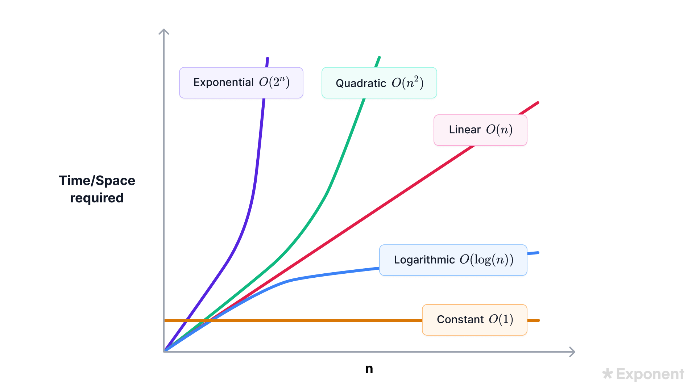

# JavaScript Algorithms

## Big O Notation Graph



## Ways to Practice
- [JavaScript Data Structures & Algorithms + LEETCODE Exercises](https://www.udemy.com/course/data-structures-algorithms-javascript/) by Scott Barrett, Udemy
- [Software Engineering Interviews](https://www.tryexponent.com/courses/software-engineering) ([TryExponent.com](https://www.tryexponent.com/) paid course)
- [Use Quokka.js Pro](https://quokkajs.com/) in Visual Studio Code
- Courses:
  - [Software Engineering Interviews](https://www.tryexponent.com/courses/software-engineering) (paid course via Exponent)
  - Eric Traub Udemy courses:
    - [Learning Data Structures in JavaScript from Scratch](https://www.udemy.com/course/learning-data-structures-in-javascript-from-scratch/?couponCode=ST14MT101024)
    - [Learning Algorithms in JavaScript from Scratch](https://www.udemy.com/course/learning-algorithms-in-javascript-from-scratch/)

## Understanding Big O Notation

- Among the three types of asymptotic notation (Big O, Omega, and Theta) **Big O notation** is the most commonly used because it provides an upper bound on an algorithm’s running time, representing the worst-case scenario.
- Comparing Big O complexity Table
  | Complexity                          | Big-O notation                    | Performance                |
  | ----------------------------------- | --------------------------------- | -------------------------- |
  | :green_heart: Constant              | :green_heart: O(1)                | :green_heart: Excellent    |
  | :white_check_mark: Logarithmic      | :white_check_mark: O(log n)       | :white_check_mark: Good    |
  | :warning: Linear                    | :warning: O(n)                    | :warning: Acceptable       |
  | :large_orange_diamond: Linearithmic | :large_orange_diamond: O(n log n) | :large_orange_diamond: Bad |
  | :exclamation: Quadratic             | :exclamation: O(n^2)              | :exclamation: Terrible     |
  | :exclamation: Exponential           | :exclamation: O(2^n)              | :exclamation: Terrible     |
  | :exclamation: Factorial             | :exclamation: O(n!)               | :exclamation: Terrible     |

## `O(n)`: Linear Time Complexity

The code below has a Big O time complexity of `O(n)`, or a __Linear__ time complexity. The time complexity of `O(n)` is __Good__, and not __Excellent__ like `O(1)` which is __Constant__ time complexity.
```js
function logitems(n) {
    for(let i = 0; i < n; i++) {
        console.log(i);
    }
}
```

## Drop Constants
The code below has a Big O time complexity of `O(2n)`. However, in Big O notation it's common to drop constants so it's commonly said the code below has a Big O time complexity of `O(n)` and __NOT__ `O(2n)`.

```js
function logitems(n) {
    for(let i = 0; i < n; i++) {
        console.log(i);
    }

    for(let j = 0; j < n; j++) {
        console.log(j);
    }    
}
```
## `O(n^2)`: Quadratic Time Complexity
The code below has a Big O time complexity of `O(n^2)`, which is considered __Terrible__. Often nested loops have a Quadratic time complexity and should be avoided whenever possible, compared to a Constant time complexity (`O(1)`) or Linear time complexity (`O(n)`).

```js
function logitems(n) {
    for(let i = 0; i < n; i++) {
        for(let j = 0; j < n; j++) {
            console.log(i, j);
        }   
    } 
}
```

## Drop Non-Dominants
The code below has a Big O time complexity of `O(n^2 + n)`. However, since `n^2` is the dominant term (or shows the largest increase in time complexity) and `n` is the non-dominant term (or shows the smallest increase in time complexity), the Big O time complexity of the code below is expressed as `O(n^2)` as the non-dominant term is dropped.

```js
function logitems(n) {
    for(let i = 0; i < n; i++) {
        for(let j = 0; j < n; j++) {
            console.log(i, j);
        }   
    } 

    for(let k = 0; k < n; k++) {
        console.log(k);
    }       
}
```

## `O(1)`: Constant Time Complexity
Example code below, which only has 1 operation and is referred to as __Constant__ time:
```js
function addItems(n) {
 return n + n;
}
```

Usually in JavaScript (or other programming languages) if a function has a `console.log` or `return` and includes __NO__ loops then the time complexity if `O(1)` or __Constant__.

__Constant__ time is the most efficient Big O notation for time.

## `O(log n)`: O of log n Time Complexity
__O of log n__ (`O(log n)`) has __Good__ time complexity, and is the most time efficient Big O notation __EXCEPT__ for __Constant__ time complexity (`O(1)`). 

The __Binary Search__ algorithm below has __O of log n__ (`O(log n)`) time complexity, assuming that a sorted array is passed in as an argument:

```js
function binarySearch(arr, target) {
  // Define the recursive function for binary search
  function searchRecursive(low, high) {
    // Base case: if the range is invalid, return -1 (not found)
    if (low > high) {
      return -1;
    }

    // Find the middle index
    const mid = Math.floor((low + high) / 2);

    // Check if the middle element is the target
    if (arr[mid] === target) {
      return mid; // Return the index of the target
    }

    // If the target is smaller than the middle element, search in the left half
    if (target < arr[mid]) {
      return searchRecursive(low, mid - 1);
    }

    // If the target is larger than the middle element, search in the right half
    return searchRecursive(mid + 1, high);
  }

  // Start the search with the entire array range
  return searchRecursive(0, arr.length - 1);
}

// Example usage:
const sortedArray = [1, 2, 3, 4, 5, 6, 7, 8];
const target = 1;
console.log(`Array Value: ${target}\nArray Index: ` + binarySearch(sortedArray, target));
```

---

## Analyzing Time Complexity

Analyzing the time complexity of an algorithm involves examining the number of operations it performs as the size of the input grows. An operation, in this context, refers to a basic computational step, such as a comparison or arithmetic operation.

### Linear Time Complexity
In this function, the number of operations scales linearly with the size of the input array arr. Thus, this function has a time complexity of `O(n)`, where `n` is the number of elements in the array. This is known as linear time complexity.

```js
function iterateArr(arr) {
   arr.map(item => console.log(item));
}
```

## Quadratic Time Complexity
Function below:
- The nested for loops iterate over all pairs of elements, resulting in `O(n^2)` time complexity.
- The separate for loop adds `O(n)` time complexity.
- When combined, the total time complexity is dominated by the quadratic term, so the overall complexity is `O(n^2)`.
```js
function quadraticExample(arr) {
    for (let i = 0; i < arr.length; i++) {
        for (let j = 0; j < arr.length; j++) {
            console.log(arr[i], arr[j]);
        }
    }
    for (let item of arr) {
        console.log(item);
    }    
}

const arr = [1, 2, 3];
quadraticExample(arr);
```

The total time complexity is the sum of these two terms: `O(n^2+n)`. However, in asymptotic analysis, we are interested in the term that grows fastest as `n` becomes very large. As `n` increases, `n^2`grows much faster than `n`.

In Big O notation, we simplify the expression by focusing on the term that grows the fastest. Therefore, `O(n^2 + n)` simplifies to `O(n^2)` because the quadratic term `n^2` dominates the linear term `n` as `n` becomes large.

Thus, we can say that `O(n^2 + n)` is asymptotically equivalent to `O(n^2)`. This simplification is a standard practice in asymptotic notation to focus on the most significant term.

## Built-in Functions Time Complexity
Some JavaScript functions don't have linear time complexity, like the `sort()` function below that is used to sort arrays which has a time complexity of `O(n  log n)` (and this is the same as `O(n * log n)`):
```js
function sortExample(arr) {
    return arr.sort();
}

sortExample(['t', 'b', 'z']);
```

Usually in computer science we only care about "log base 2 of y" of something like `log base 2 of y`. For example, "log base 2 of 8" in JavaScript is written as `Math.log2(8)` and the output of this would be an integer of `3`.

## `O(2 ^ n)` Function Example
For each value of `n`, it makes two recursive calls, leading to a total of `2 ^ n` function calls in the worst case:
```js
function twoToPowerOfN(n) {
    if (n <= 1) {
        return 1;
    } else {
        return func4(n - 1) + func4(n - 2);
    }
}
```
